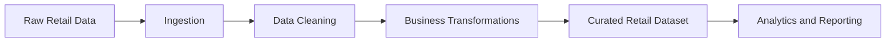

# Retail Data Engineering Pipeline


## Overview

This repository is a portfolio data-engineering project focused on retail data processing and analytics preparation. It is designed to demonstrate how raw retail datasets can be ingested, cleaned, transformed, and structured for downstream reporting, business intelligence, and operational analysis.

The project highlights practical data-engineering skills that are valuable in production environments: pipeline design, transformation logic, data validation, quality checks, and analytics-ready output modeling.

## Business Use Case

Retail organizations depend on reliable data pipelines to understand sales performance, product behavior, customer activity, inventory patterns, and operational trends. A well-designed retail pipeline helps convert raw transactional or operational data into trusted datasets that analytics teams can use for faster and more accurate decision-making.

## Engineering Focus

- Ingest raw retail data from source files or structured datasets
- Clean and standardize records for consistent downstream use
- Transform raw data into curated analytical layers
- Support reporting use cases through SQL-friendly structures
- Apply validation checks for completeness, consistency, and schema quality
- Present the project clearly for technical reviewers and recruiters

## Conceptual Pipeline



## Example Analytics Questions

This type of pipeline can support questions such as:

- Which products or categories drive the most sales?
- How do sales trends change over time?
- Where are data quality gaps affecting reporting accuracy?
- Which operational metrics should be modeled for dashboarding?
- How can raw data be structured for repeatable business analysis?

## Skills Demonstrated

- Data pipeline design and ETL/ELT fundamentals
- Python-based data processing patterns
- SQL analysis and transformation logic
- Data cleaning and validation strategy
- Analytics-focused data modeling
- Git/GitHub project documentation practices

## Suggested Repository Enhancements

The README now provides a professional project landing page. Strong next additions would be:

- Dataset source and schema description
- Exact setup and execution commands
- Sample output tables or dashboard screenshots
- Data quality report with row counts, null checks, and duplicate checks
- Architecture notes explaining each pipeline stage
- Before/after examples of raw versus curated records

## Getting Started

Clone the repository:

```bash
git clone https://github.com/jairammaddala/Retail-data-engineering-pipeline.git
cd Retail-data-engineering-pipeline
```

Then review the available scripts, notebooks, SQL files, or data assets in the repository. Add project-specific setup commands here once the final execution workflow is standardized.

## Author

**Jairam Maddala**  
Software Engineer focused on AI-powered data systems, ETL/ELT pipelines, backend reliability, and cloud-native data platforms.

- GitHub: [jairammaddala](https://github.com/jairammaddala)
- Email: [maddalajairam@gmail.com](mailto:maddalajairam@gmail.com)
